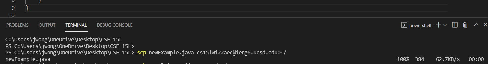
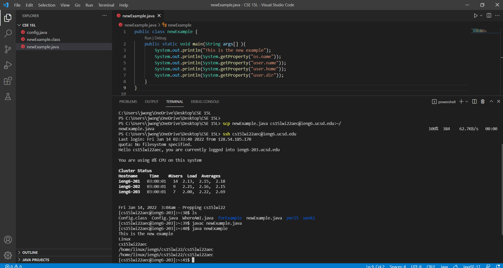
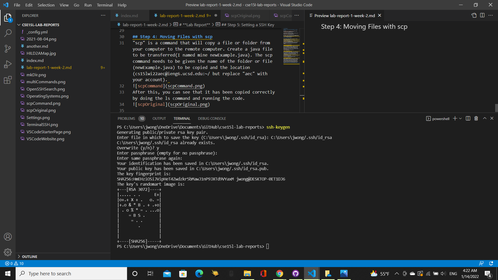
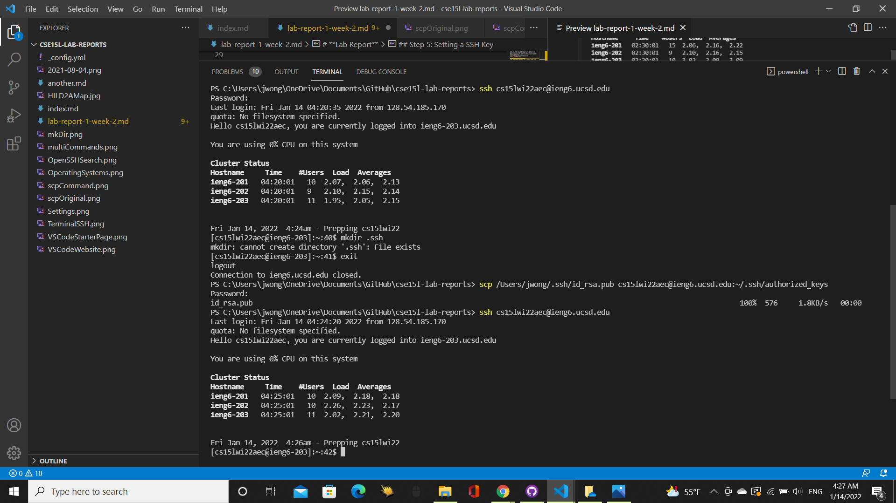

# **Lab Report**

## Step 1: Install Visual Studio Code(Skip if already installed)

Go to [https://code.visualstudio.com/]( https://code.visualstudio.com/) to download the code.

On that website, make sure to choose the download that is appropriate for your operating system.

From there, follow the instructions of the VSCodeUserSetup.
This step is only for those who do not have VSCode. If you do, then open VSCode and have it ready. 

## Step 2: Connecting Remotely

Go to Settings, then go to Apps, and then go to Apps & Feautues, and click on Optional Features. 

Click "Add a feature" and search for "OpenSSH Client" and "OpenSSH Server" and install them. 

Enter "ssh cs15lwi22zz@ieng6.ucsd.edu" into your terminal but remember to switch out the "zz" with your course specific account and enter the password, and "yes" if prompted.

## Step 3: Trying Some Commands
You are now connected to the remote computer and can now try out some commands. Some useful commands we went over were "ls" which will show the files and folders in the directory, "cd" which will change the directory to the given directory, "pwd" which will print the path of the working directory, and "mkdir" which will make a directory with the given name,.

## Step 4: Moving Files with scp
"scp" is a command that will copy a file or folder from your computer to the remote computer. Create a java file to be transferred(I named mine newExample.java). The scp command needs to be given the name of the folder or file(newExample.java) to be copied and the location(cs15lwi22aec@ieng6.ucsd.edu:~/ but replace "aec" with your account). 

After this, you can see that it has been copied correctly by doing the ls command and running the code.

## Step 5: Setting a SSH Key
Enter "ssh-keygen" into your terminal and then "/Users/jwong/.ssh/id_rsa"(switch jwong with your own) and keep pressing enter until you see a square appear. 

Enter "ssh cs15lwi22zz@ieng6.ucsd.edu"(with zz replaced with your account) to enter the remote computer and type "mkdir .ssh" into the terminal then type "exit". Now enter "scp /Users/jwong/.ssh/id_rsa.pub cs15lwi22@ieng6.ucsd.edu:~/.ssh/authorized_keys"(but with jwong switched out with yours).

## Step 6: Optimizing Remote Running

