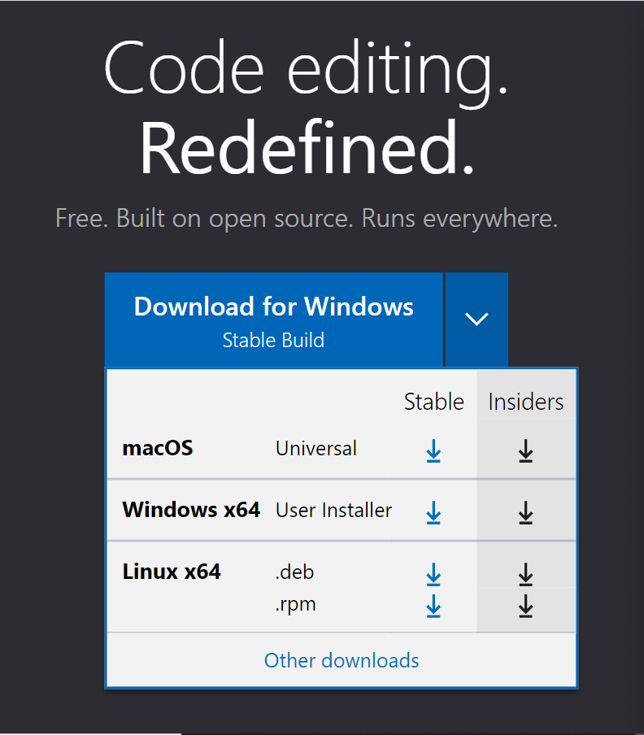

Step 1: Install Visual Studio Code(Skip if already installed)

Go to [https://code.visualstudio.com/]( https://code.visualstudio.com/) to download the code.

On that website, make sure to choose the download that is appropriate for your operating system.

From there, follow the instructions of the VSCodeUserSetup.
This step is only for those who do not have VSCode. If you do, then open VSCode and have it ready. 

Step 2:

