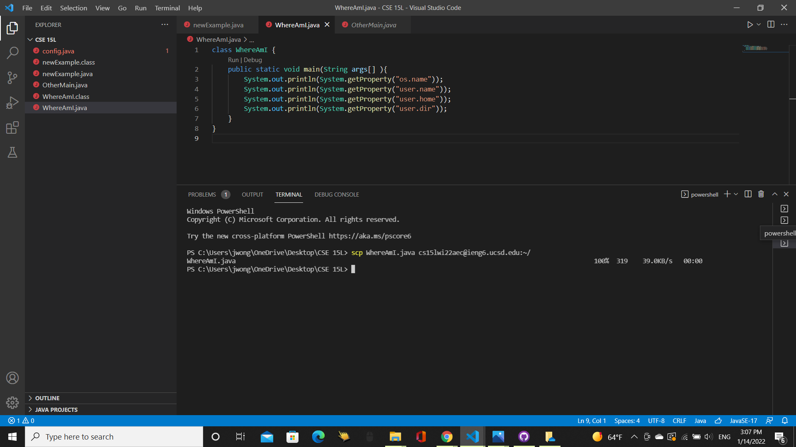
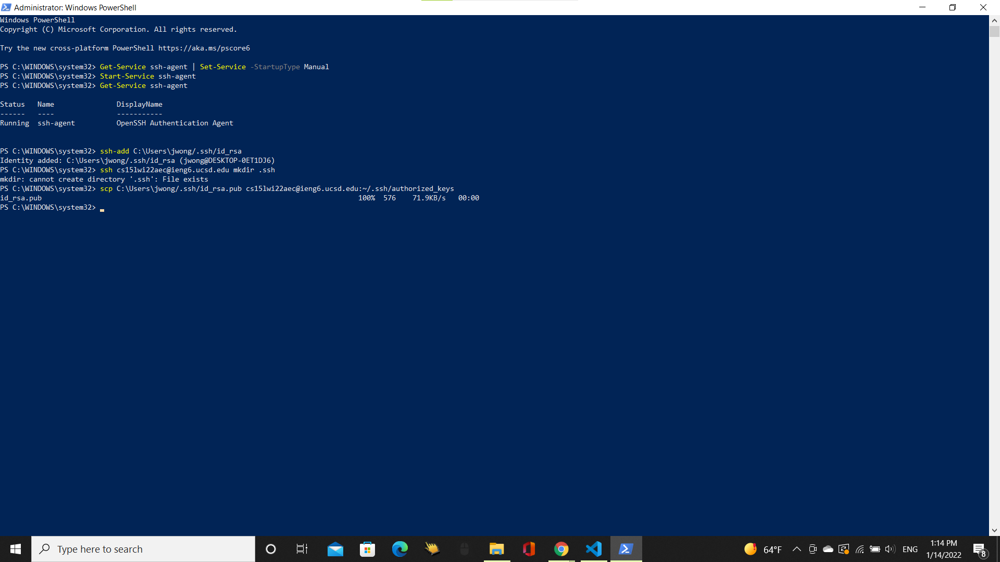

# **Lab Report**

## Step 1: Install Visual Studio Code(Skip if already installed)

Go to [https://code.visualstudio.com/]( https://code.visualstudio.com/) to download the code.


On that website, make sure to choose the download that is appropriate for your operating system.


From there, follow the instructions of the VSCodeUserSetup.
This step is only for those who do not have VSCode. If you do, then open VSCode and have it ready. 


## Step 2: Connecting Remotely

Go to Settings, then go to Apps, and then go to Apps & Feautues, and click on Optional Features. 

Click "Add a feature" and search for "OpenSSH Client" and "OpenSSH Server" and install them. 

Enter `ssh cs15lwi22aec@ieng6.ucsd.edu` into your terminal but remember to switch out the `aec` with your course specific account and enter the password, and answer `yes` if prompted.


## Step 3: Trying Some Commands
You are now connected to the remote computer and can now try out some commands. Some useful commands we went over were `ls` which will show the files and folders in the directory, `cd` which will change the directory to the given directory, `pwd` which will print the path of the working directory, and `mkdir` which will make a directory with the given name,.


## Step 4: Moving Files with scp
`scp` is a command that will copy a file or folder from your computer to the remote computer. Create a java file to be transferred(I named mine newExample.java). The scp command needs to be given the name of the folder or file(`WhereAmI.java`) 
```
class WhereAmI {
  public static void main(String[] args) {
    System.out.println(System.getProperty("os.name"));
    System.out.println(System.getProperty("user.name"));
    System.out.println(System.getProperty("user.home"));
    System.out.println(System.getProperty("user.dir"));
  }
}
```
to be copied and the location(`cs15lwi22aec@ieng6.ucsd.edu:~/` but replace `aec` with your account). 

After this, you can see that it has been copied correctly by doing the ls command and running the code.


## Step 5: Setting a SSH Key(Windows-Specific Since I Used Windows)
I entered `ssh-keygen` into my terminal and then `C:\Users\jwong/.ssh/id_rsa`(switch jwong with your own) and kept pressing enter until the square appeared.
 

Next open Windows PowerShell as administrator and type in these commands.
```
Get-Service ssh-agent | Set-Service -StartupType Manual
Start-Service ssh-agent
Get-Service ssh-agent
ssh-add ~\.ssh\id_ed25519
```
Then enter these commands. 
```
ssh cs15lwi22aec@ieng6.ucsd.edu mkdir .ssh
scp C:\Users\jwong/.ssh/id_rsa.pub cs15lwi22aec@ieng6.ucsd.edu:~/.ssh/authorized_keys
```
(I entered the last two in powershell but they can be entered in VSCode)

Now you should be able to enter into your account without needing to type in a password.


## Step 6: Optimizing Remote Running
Running code on the same line can make remote running more efficient. For example, "ssh cs15lwi22@ieng6.ucsd.edu "ls"" will log into the account and run ls over there and then exit.

Typing "cp WhereAmI.java OtherMain.java; javac OtherMain.java; java WhereAmI" will copy WhereAmI.java to a new OtherMain.java file, compile OtherMain, and then run WhereAmI.


