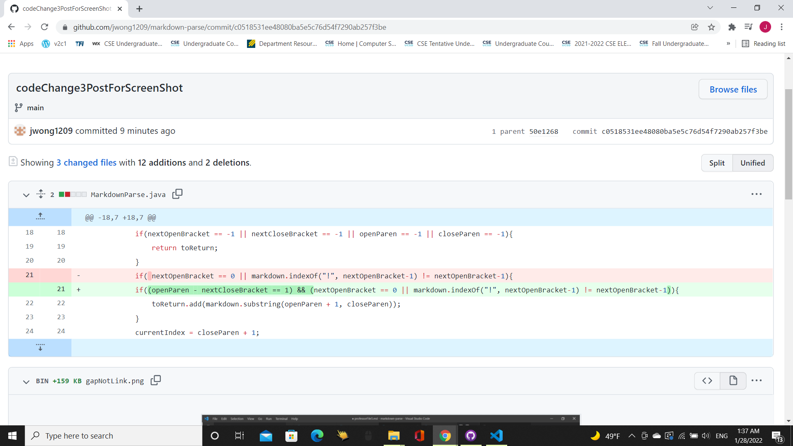

# **Lab Report 2 Week 4**

## Code Change 1: Fixing Infinite While Loop
Fix for Infinite While Loop: 

Link to Failure-Inducing Input: [https://github.com/jwong1209/markdown-parse/blob/c0518531ee48080ba5e5c76d54f7290ab257f3be/test-file2.md](https://github.com/jwong1209/markdown-parse/blob/c0518531ee48080ba5e5c76d54f7290ab257f3be/test-file2.md)

Symptom of Failure-Inducing Input: 

Explanation: The bug is the line in the code `currentIndex = closeParen + 1` which will reset the `currentIndex` back to the last parenthesis's index. This is an issue because if the last `)` is not at the end as in the case of `test-file2.md`, then the condition `currentIndex < markdown.length()` would never be fulfilled and thus cause the while loop to keep repeating and the inside code to keep traversing through the file. This is fixed by checking if one of the variables is equal to -1 and doing `return toReturn` if true because at least one of them will be if you tried to find the indexOf a bracket or parenthesis during one of the while loop's faulty iterations.

## Code Change 2: Fixing Code Giving Images as Links
Fix for Image: 

Link to Failure-Inducing Input: [https://github.com/jwong1209/markdown-parse/blob/c0518531ee48080ba5e5c76d54f7290ab257f3be/test-file4.md](https://github.com/jwong1209/markdown-parse/blob/c0518531ee48080ba5e5c76d54f7290ab257f3be/test-file4.md)

Symptom of Failure-Inducing Input:

Explanation: The bug is that the code only uses the index of the brackets(`[` and `]`) and parenthesis(`(` and `)`) to decide what is a link or not. Since the format for an image is similar to the link format with its use of brackets and parenthesis, this causes the code to identify images as links  such as `cat.png` and `cow.png` from the `test-file4.md` file and add them to `toReturn`. To fix this, I used the exclamation mark as the differentiator between images and links since image format has that at the start and if a `[` had a `!` in front of it, then it would mean its an image and would not pass the `(nextOpenBracket == 0 || markdown.indexOf("!", nextOpenBracket-1) != nextOpenBracket-1)` condition of the if statement and therefore the `toReturn.add(markdown.substring(openParen + 1, closeParen))` inside the if statement would not get activated. 

## Code Change 3: Fixing Code Giving Links When Characters Exist Between `]` and `(`
Fix for Code Giving Link Despite Characters Existing Between Bracket and Parenthesis:

Link to Failure-Inducing Input: 
[https://github.com/jwong1209/markdown-parse/blob/c0518531ee48080ba5e5c76d54f7290ab257f3be/professorFile5.md](https://github.com/jwong1209/markdown-parse/blob/c0518531ee48080ba5e5c76d54f7290ab257f3be/professorFile5.md)

Symptom of Failure-Inducing Input:

Explanation: The bug is that the code only looks at where the `[` is and then the `]` and then the `(` and then the `)` is but does not take into account the distance between the `]` and`(`. That means even though in `professorFile5.md` there are characters between the `]` and `(`, it still prints `page.com` as if it were a correctly formatted link when it should not since there are characters in between. The fix for this was checking that the `]` and `(` were right next to each other by adding `(openParen - nextCloseBracket == 1)` into the condition of the if statement and therefore the `toReturn.add(markdown.substring(openParen + 1, closeParen))` inside the if statement would not get activated if the distacne between `openParen` and `nextCloseBracket` was greater than 1 meaning there were characters between them. 