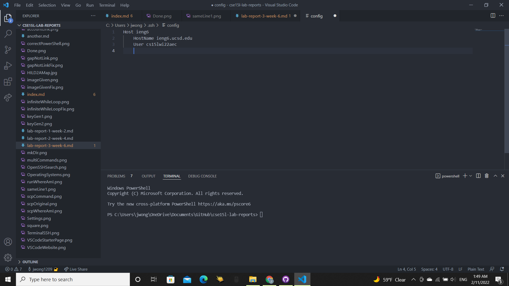

# **Lab Report 3 Week 6**

## Streamlining ssh Configuration

## `.ssh/config` File and Where It Was Edited
This is my `.ssh/config` file and where it is located. 

`.ssh/config` location: 

I edited the config file with VSCode. I chose my alias to be `ieng6` like how the professor did, so I had `Host ieng6` at the top.

`.ssh/config` file: 

## Logging in With Alias `ieng6`
This is me logging in with the created alias. I typed `ssh ieng6` into the terminal and that would log me in. This is helpful since before I would need to type out `ssh cs15lwi22aec@ieng6.ucsd.edu` but I often forgot the command and would need to copy paste it. With `ssh ieng6` which is much shorter and easier to remeber, logging in can be easier and quicker.

Logging In: 

## `scp` Command Using Alias
Commands can now be run with the alias(`ieng6`) instead of the full login(`cs15lwi22aec@ieng6.ucsd.edu`). 
As you can see in this image, we do not have the `aliasTest.java` file on the server yet.

Now with the `scp aliasTest.java ieng6:~/` command, we can move a copy of the `aliasTest.java` onto the server which you can see here.

The alias makes the command easier to type since before it would have been `scp aliasTest.java cs15lwi22zz@ieng6.ucsd.edu:~/` but now it is only `scp aliasTest.java ieng6:~/`. 