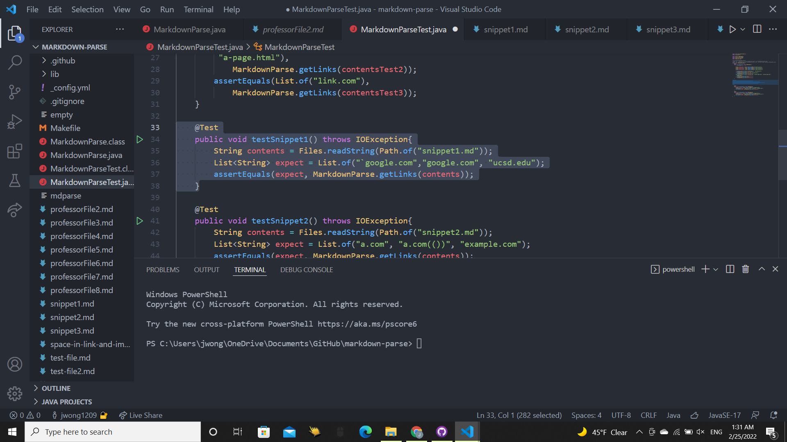
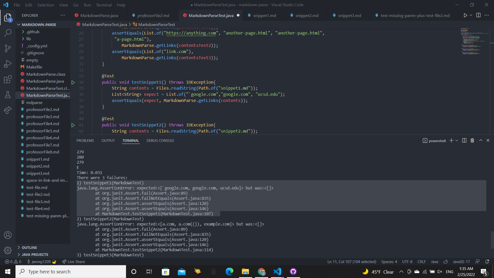
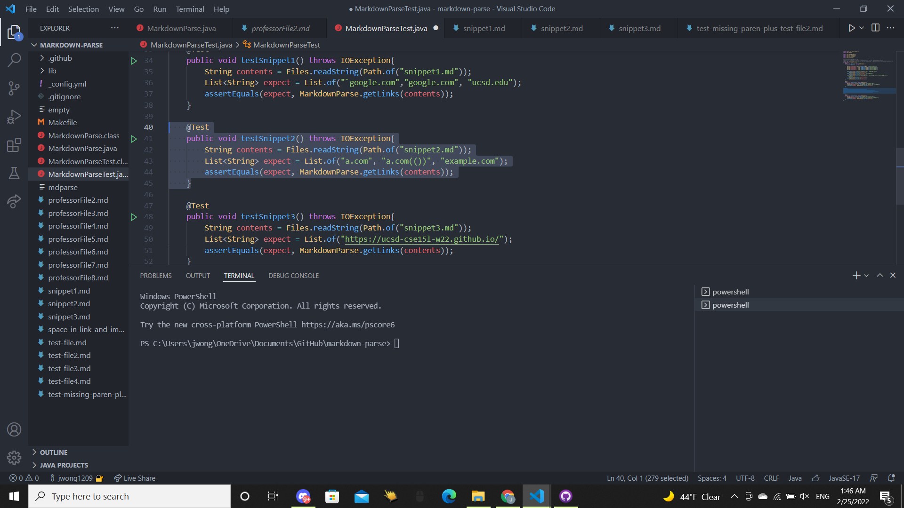
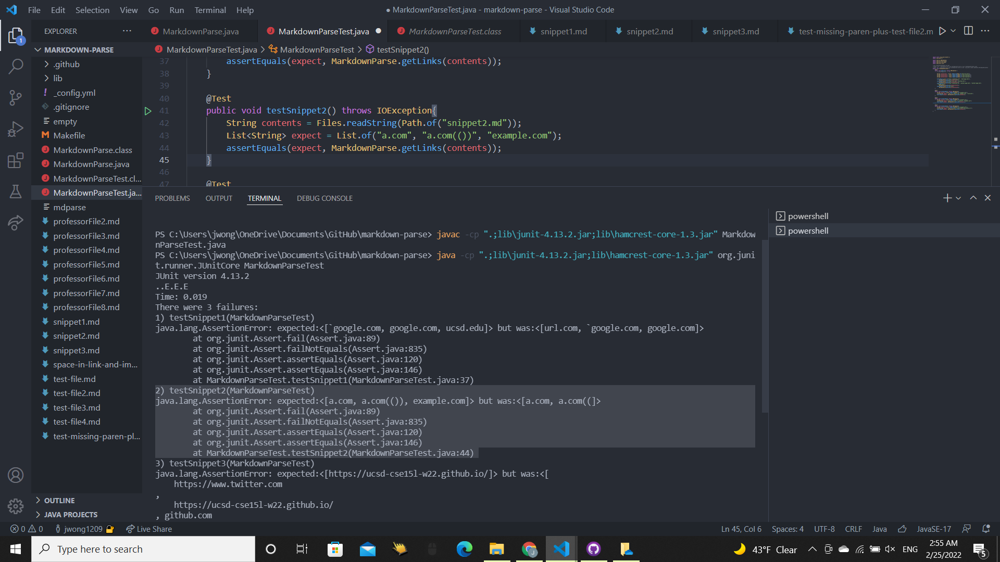
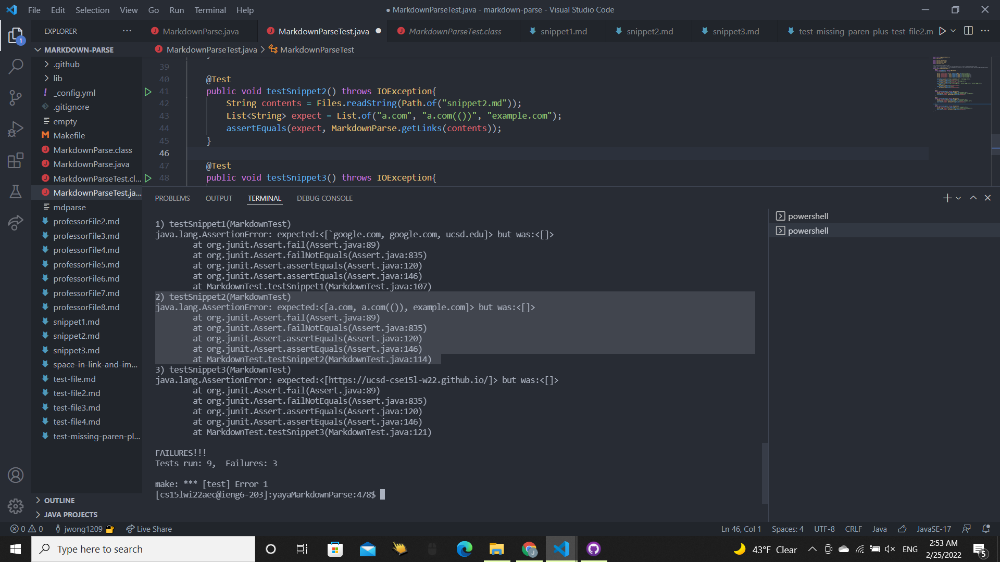
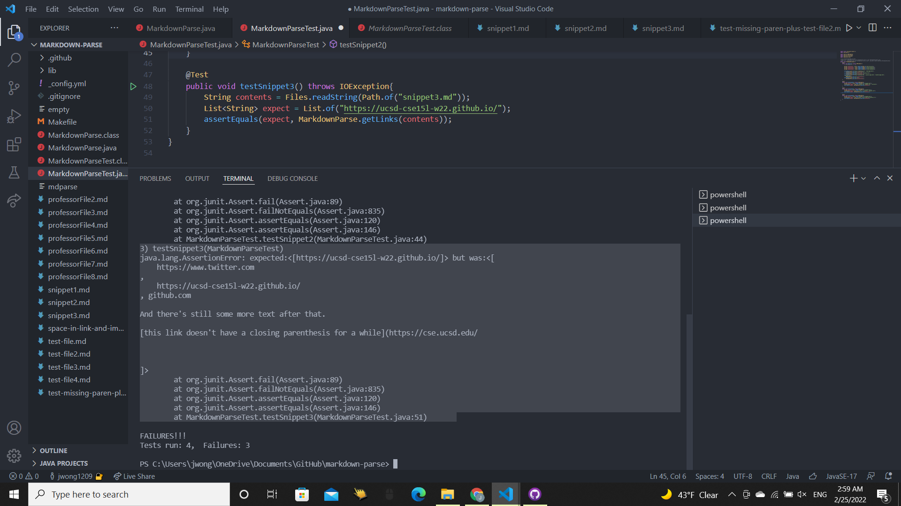
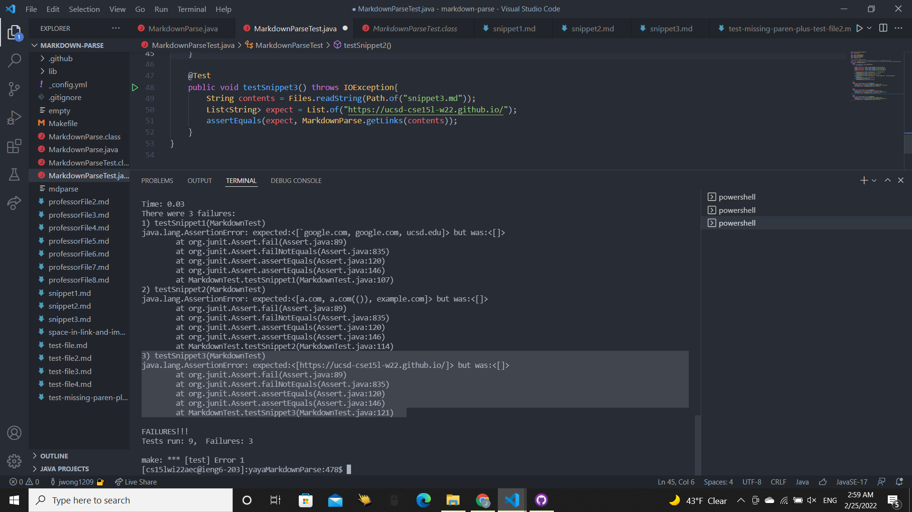

# **Lab Report 4 Week 8**

## Snippet 1
Test for Snippet 1:

Snippet 1 on My Implementation: My implementation failed the test since it gave `url.com` when it should not have and did not give `ucsd.edu` when it should have.

Snippet 1 on Reviewed Implementation: The implementation I reviewed with my lab group failed the test since it gave a no links when it should have given ``google.com`, `google.com`, and `ucsd.edu`.

## Snippet 2
Test for Snippet 2:

Snippet 2 on My Implementation: My implementation failed the test since it gave `a.com((` when it was supposed to give `a.com(())`, and because it did not give `example.com` when it should have.

Snippet 2 on Reviewed Implementation: The implementation I reviewed with my lab group failed the test since it gave no links when it should have given `a.com`, `a.com(())`, and `example.com`.

##Snippet 3
Test for Snippet 3:

Snippet 3 on My Implementation: My implementation failed the test since it should have provided only `https://ucsd-cse15l-w22.github.io/` but gave more links than that. 

Snippet 3 on Reviewed Implementation: The implementation I reviewed with my group failed the test since it provided no links when it should have given `https://ucsd-cse15l-w22.github.io/`. 

## Code Changes
Code Changes for Snippet 1:
The code changes to make the program handle code blocks correctly would likely take under 10 lines. It would mostly involve having variables store the index position of the backticks starting and ending the code blocks. If there is only a single backtick, that means it is not a code block and could be processed like the rest of the lines. If there are 2 backticks found together, then the code would check the index of the backticks in relation to the index of the brackets and parenthesis. If the front codetick is found to be before the open bracket like in `url.com`, then it is counted as a code block and the code skips to the index of the end codetick + 1 and parses from there. If the front codetick is found to be inside the brackets but not the end codetick, then it is a codeblock and the code should skip to the index of end codetick +1 and parse from there. Since the changes would require only adding new instance variables to track index of backticks and if conditionals, I think it could be done under 10 lines.

Code Changes for Snippet 2:
My code incorrectly handles the nested parenthesis case and the escaped brackets case. To fix this I believe I would need more than 10 lines since I would need to create a helper method to find the corresponding end parenthesis of the open parenthesis beginning the link, and then I could print the link that is between them. The helper method would be like the one that Professor Politz displayed in his lectures which starts at an open parenthesis and then keeps looping through the text file until the openParenthesisCount is zero and then returns the index when openParentthesisCount hit 0. This method would be similar to Professor Politz's `findCloseParen(String markdown, int openParen)` method. I would also need to create a separate version of it, `findCloseBracket(String markdown, int openBracket)`, to handle the nested bracket case described by `[some escaped \[ brackets \]](example.com)` while adding a condition to the if statements that there is not a `\` before the `[` or `]` and if there is to not increment or decrement the bracketCounter. Another if condition would need to be added so that if is there is are parenthesis between brackets like in the case of `[a [nested link](a.com)](b.com)`, it would exit the method and parse the link in the parenthesis. I would use the `findCloseBracket` method to set the variable in getLinks, nextCloseBracket, and start parsing from there. Totaling the lines required for both methods, it would be at least 20 lines since the method Professor Politz used needed a little over 10 lines and I would need two of those methods, one for nested parenthesis and one for nested brackets. 

Code Changes for Snippet 3:
Snippet 3 tests for how my code would handle newlines within brackets and parenthesis. For the bracket case, I would write a helper boolean method `isConsecutiveNewLineBracket` containing a for-loop from the beginning bracket to the corresponding end bracket that checks if there are two consecutive new lines. If there are then the `isConsecutive` method returns `false`. I would also need to write another helper method for newlines between parenthesis called `newLineParenthesis` that checks the index of newLines between the parenthesis. If there is a newLine immediately after the `(` or immediately before the `)` then it is fine and returns true, or there are no newLines it would return true. Otherwise it returns false. I would add an if condition in `getLinks` that checks that both `isConsecutiveNewLineBracket` and `newLineParenthesis` are true and if they are false to set currentIndex to the index of the next open bracket and begin parsing from there. 