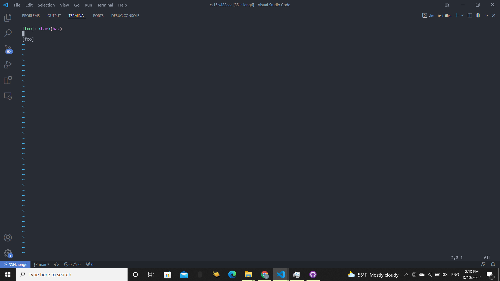
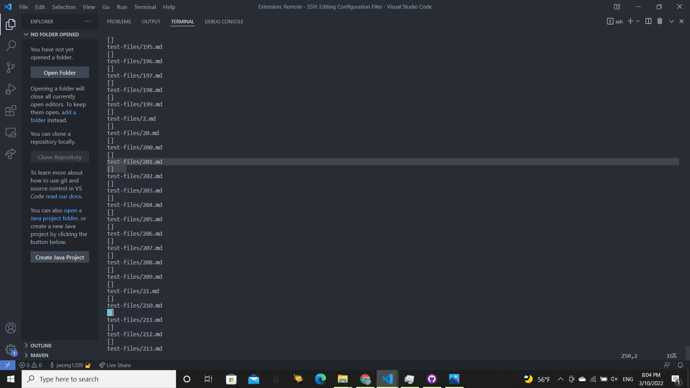
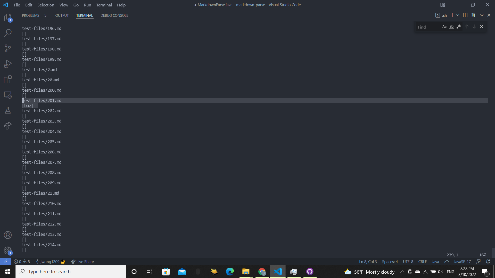
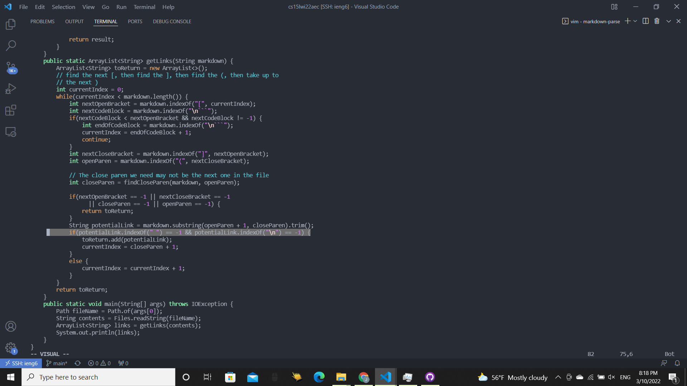

# **Lab Report 5 Week 10**

## Method of finding tests
I found these differing test cases manually by looking through a file created by `bash script.sh > labReportResultPersonal` which contained my test results on test-files and comparing it to a file created by `bash script.sh > labReportResultProfessor` which contained the professor's test results.

## Test 201:
Image of Test: 

My Output: 

Professor's Output:

Issue in Code: 

Since there are characters between the `]` and `(`, the contents inside the parenthesis should not count as a link. My implementation of MarkdownParse is correct since it did not give any links for this test while the professor's did give `[baz]` as an output. The bug here is that the professor's code does not check whether the `]` and `(` are right next to each other. This could be done by making sure that the index of `]` is one before the index of `(`. This could be done by putting it as a condition of the if statement whose body has the code that adds the link to the ArrayList. 

## Test 481:
Image of Test: 

My Output: 

Professor's Output: 

Issue in Code: 

Neither output is correct since the expected output is `[my]` according to the common mark demo site. The professor's code did not consider it a link at all. The bug in the program is the if condition before adding the link into the ArrayList. The condition is `potentialLink.indexOf(" ") == -1` which only considers potentialLinks without spaces as a link. This is incorrect since a potentialLink could have a space in it and still be considered an actual link. 